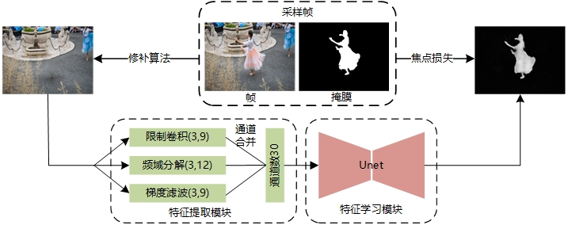

# video-inpainting-detection
深度视频修补（目标删除）伪造检测

## 检测算法参考

HPFCN(pytorch)：[lihaod/Deep_inpainting_localization: Implementation of “Localization of Deep Inpainting Using High-Pass Fully Convolutional Network” (github.com)](https://github.com/lihaod/Deep_inpainting_localization)

```
@inproceedings{li2019localization,
  title={Localization of deep inpainting using high-pass fully convolutional network},
  author={Li, Haodong and Huang, Jiwu},
  booktitle={Proceedings of the IEEE/CVF International Conference on Computer Vision},
  pages={8301--8310},
  year={2019}
}
```

IIDNET：[HighwayWu/InpaintingForensics (github.com)](https://github.com/HighwayWu/InpaintingForensics)

```
@article{wu2021iid,
  title={IID-Net: Image Inpainting Detection Network via Neural Architecture Search and Attention},
  author={Wu, Haiwei and Zhou, Jiantao},
  journal={IEEE Transactions on Circuits and Systems for Video Technology},
  year={2021},
  publisher={IEEE}
}
```

Pre-filter{

DctFilters：[yyk-wew/F3Net: Pytorch implementation of F3Net (ECCV 2020 F3Net: Frequency in Face Forgery Network) (github.com)](https://github.com/yyk-wew/F3Net)

SobelConv，BayarConv：[dong03/MVSS-Net: code for Image Manipulation Detection by Multi-View Multi-Scale Supervision (github.com)](https://github.com/dong03/MVSS-Net)

}+Unet

## 网络结构



## 预滤波模块消融实验（IOU/F1）

|       Networks       |      DVI      |     CPNET     |      OPN      |     STTN      |     DSTT      |     FUSE      |
| :------------------: | :-----------: | :-----------: | :-----------: | :-----------: | :-----------: | :-----------: |
|         Unet         |   0.60/0.71   |   0.43/0.55   |   0.36/0.48   |   0.67/0.78   |   0.84/0.90   | **0.66/0.77** |
|      Bayer+Unet      |   0.63/0.74   |   0.44/0.56   | **0.41/0.54** | **0.71/0.81** | **0.85/0.91** |   0.62/0.73   |
|      Sobel+Unet      |   0.57/0.68   | **0.48/0.60** |   0.32/0.44   |   0.48/0.61   |   0.83/0.90   |   0.55/0.67   |
|       DCT+Unet       |   0.44/0.55   |   0.39/0.51   |   0.17/0.26   |   0.57/0.69   |   0.72/0.82   |   0.37/0.48   |
| Bayer+Sobel+DCT+Unet | **0.65/0.76** |   0.46/0.59   |   0.37/0.48   |   0.61/0.73   |   0.83/0.90   |   0.63/0.74   |

